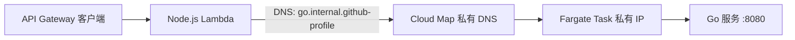

# Lambda 通过 Cloud Map 调用 ECS Go 服务

这条链路使用 Cloud Map 私有 DNS，不经过公网 ALB：



Cloud Map 创建与 VPC 关联的 Route 53 私有托管区。ECS 会在任务启动和停止时自动注册、注销任务私有 IP。
Lambda 与 ECS 位于同一个 VPC，因此可以解析并访问 `go.internal.github-profile`。

## 安全边界

- Lambda 只调用固定的 `/healthz`，不会代理用户提供的 URL 或路径。
- 请求超时为 3 秒，上游错误不会把内部 DNS 或异常信息返回给客户端。
- Go 服务安全组的 8080 端口只允许 Lambda 安全组进入。
- Lambda 使用 DNS 查询，不需要 `servicediscovery:DiscoverInstances` IAM 权限。

## 部署前配置

先在 ECS 服务「网络」或「资源」信息中确认两项：

- ECS 任务所在 VPC 必须与 GitHub 变量 `VPC_ID` 完全相同。Cloud Map 私有 DNS 只在绑定的 VPC 内解析。
- 重新复制 ECS Go 服务当前使用的安全组 ID，作为 `GO_SERVICE_SECURITY_GROUP_ID`。

启用后会创建一个 Route 53 私有托管区，因此会产生少量持续费用；练习结束后可按本文末尾顺序清理。

将 [Cloud Map 部署权限](../infra/iam/cloud-map-deploy-policy.example.json) 作为内联策略添加到
GitHub Actions 当前使用的 SAM 部署角色。

GitHub Actions 仓库变量：

| 变量 | 值 |
| --- | --- |
| `ENABLE_CLOUD_MAP_INTEGRATION` | `true` |
| `CLOUD_MAP_NAMESPACE_NAME` | `internal.github-profile` |
| `GO_SERVICE_SECURITY_GROUP_ID` | ECS Go 服务当前使用的安全组 ID |

当前 ECS Express Service 是 `default/github-profile-cluster-f0e1`。安全组 ID 必须从该服务的「资源」页重新确认，
不要只依赖旧截图中的值。

## 部署顺序

1. 推送代码，让现有 SAM 工作流更新 `github-profile-sam-dev`。
2. 在 CloudFormation 输出中复制 `GoServiceDiscoveryServiceArn`。
3. ECS → `default` 集群 → `github-profile-cluster-f0e1` → 更新服务。
4. 将 Cloud Map 服务注册表 ARN 绑定到 ECS 服务并触发滚动部署。
5. 等新任务为 Running，确认 Cloud Map 的 `go` 服务出现一个实例。
6. 调用 `GET /api/go/health`，预期返回：

```json
{
  "discovery": "cloud-map",
  "service": "github-profile-go",
  "status": "ok"
}
```

## 清理顺序

Cloud Map 服务包含 ECS 注册实例时不能直接删除。必须按以下顺序清理：

1. 从 ECS Service 移除 Service Registry，并等待滚动部署完成。
2. 将 `ENABLE_CLOUD_MAP_INTEGRATION` 改为 `false`，重新部署 SAM。
3. CloudFormation 才能安全删除 Cloud Map 服务、命名空间和私有托管区。
