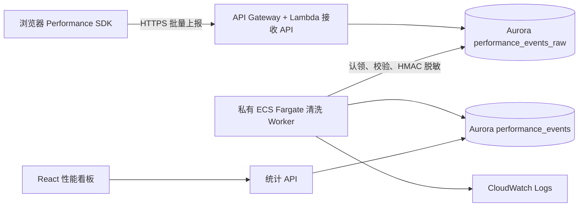

# 性能日志采集、ECS 清洗与可视化

正式演示入口为
[https://github-profile-sam-chi111.chi435900020.workers.dev](https://github-profile-sam-chi111.chi435900020.workers.dev)。
登录后点击左侧 **Performance**。PR 预览只验证隔离的 Go 服务路由，不提供管理后台登录；SAM 输出的
S3 website URL 是静态源站产物，也不是启用凭证登录的正式入口。

本功能把浏览器性能事件分成“接收、清洗、查询”三个边界。API 先把经过大小和结构校验的批次写入
Aurora 原始事件表，私有 ECS Fargate Worker 再异步认领待处理记录、脱敏并写入清洗表，统计 API
只查询清洗后的数据。这样接收请求不必等待聚合计算，清洗失败也可以从原始记录定位和重试。



## 数据与运行时契约

- SDK 一批最多发送 50 个事件；服务端限制请求体为 128 KiB，并按 `eventId` 幂等接收。
- 事件覆盖页面访问、Web Vitals、导航、资源、HTTP、前端错误和自定义指标。`route` 只能是无查询串、
  无 fragment 的路径。
- LCP、CLS、INP 等会在页面隐藏、离开或 SPA 路由切换时各提交一次最终值，不把中间累计值当作独立样本；
  导航耗时则在 `load` 事件完成后的下一个任务读取。
- `performance_events_raw` 是短期处理缓冲区，记录处理、拒绝和重试状态；处理或永久拒绝后会立即把
  `payload` 缩减为 `eventId/eventType`，不继续保留原始 session。
- `performance_events` 只存清洗后的分析字段。原始 `sessionId` 会用服务端密钥做 HMAC-SHA256，
  查询接口只能看到不可逆的 `sessionHash`。
- Worker 是常驻进程，入口为 `node dist/performance-log-worker.mjs`。运行时需要
  `DATABASE_URL`、`PERFORMANCE_HASH_SECRET`、`PERFORMANCE_WORKER_POLL_INTERVAL_MS` 和
  `PERFORMANCE_WORKER_BATCH_SIZE`；API Lambda 使用 `PERFORMANCE_INGEST_ENABLED` 控制生产采集入口。
- Worker 的应用日志进入 `/ecs/<ProjectName>/performance-worker`；不要把事件 payload、数据库连接串或
  HMAC 密钥写入 CloudWatch。

## AWS 部署

SAM 中的 Worker 默认关闭，因此原有部署不需要镜像、ECS 或新增 IAM 权限。启用前先执行数据库迁移，
构建 server bundle，再从仓库根目录作为 Docker build context 构建镜像。根目录 context 会同时加入
bundle 和 AWS RDS CA bundle：

```bash
pnpm --filter server build
pnpm db:migrate

docker buildx build \
  --platform linux/arm64 \
  --file apps/server/Dockerfile.performance-worker \
  --tag PERFORMANCE_WORKER_ECR_URI:RELEASE \
  --push \
  .
```

CI 仍通过 VPC 内的幂等 Setup Lambda 创建表；`0002_performance_events.sql` 同样使用
`IF NOT EXISTS`，因此之后运行 Drizzle migration 会安全记录该版本，不会因 Setup 已创建关系而失败。

把不可预测且与 JWT 不同的 HMAC 密钥作为 `PerformanceHashSecret` 参数传入，然后部署：

```bash
sam validate --template-file infra/sam/template.yaml
sam deploy \
  --config-file infra/sam/samconfig.toml \
  --template-file infra/sam/template.yaml \
  --parameter-overrides \
    EnablePerformanceLogWorker=true \
    PerformanceWorkerImageUri=PERFORMANCE_WORKER_ECR_URI:RELEASE \
    PerformanceHashSecret=REPLACE_WITH_A_RANDOM_32_BYTE_SECRET
```

GitHub Actions 默认同时关闭 Worker 和生产日志入口，避免未清洗的 raw 事件积压。设置变量
`ENABLE_PERFORMANCE_LOG_WORKER=true` 和至少 32 字符的
Secret `PERFORMANCE_HASH_SECRET` 后，工作流会创建或复用 `PERFORMANCE_WORKER_ECR_REPOSITORY`、构建
arm64 镜像、推送以 commit SHA 命名的 tag，并把镜像 URI 和下表参数传给 SAM。SDK 则由
`VITE_PERFORMANCE_ENABLED`、`VITE_PERFORMANCE_APP_ID`、`VITE_RELEASE_VERSION` 和
`VITE_APP_ENV` 配置。受限的部署角色还需允许创建/推送 ECR，并允许 CloudFormation 管理 ECS
Cluster/Service/Task Definition、执行角色、Secrets Manager Secret、CloudWatch Log Group 和
Worker 安全组，以及把本栈创建的执行角色传给 ECS。

若 `samconfig.toml` 已有参数覆盖，需把以上参数合并到同一组配置，不要用命令行覆盖后意外丢失
`DatabaseUrl`、`JwtSecret`、VPC 和子网参数。还可以调整：

| 参数 | 默认值 | 用途 |
| --- | ---: | --- |
| `PerformanceWorkerDesiredCount` | `1` | 常驻 Fargate 任务数 |
| `PerformanceWorkerPollIntervalMs` | `5000` | 空队列轮询间隔 |
| `PerformanceWorkerBatchSize` | `100` | 每轮认领上限 |
| `PerformanceWorkerLogRetentionDays` | `30` | Worker CloudWatch 日志保留天数 |
| `PerformanceRawRetentionDays` | `7` | raw envelope（包括超龄 pending）保留天数 |
| `PerformanceCleanRetentionDays` | `90` | 清洗后分析事件保留天数 |
| `PerformanceIngestBurstLimit` | `10` | 仅日志采集路由的 API Gateway 突发请求上限 |
| `PerformanceIngestRateLimit` | `5` | 仅日志采集路由的 API Gateway 每秒持续请求上限 |

模板会创建独立 ECS Cluster、Task Definition、Service、执行角色、CloudWatch Log Group、数据库
Secret 和安全组。Service 没有 ALB、监听端口或入站安全组规则，`AssignPublicIp` 固定为
`DISABLED`。Aurora 5432 只新增来自 Worker 安全组的入站规则。

不要在保持 `EnablePerformanceLogWorker=true` 时单独把 `PerformanceWorkerDesiredCount` 设为 `0`；
这会继续接收事件但暂停清洗。需要紧急停用时应同时设置 `EnablePerformanceLogWorker=false`，从而关闭
生产采集入口。

Worker 必须位于能访问 AWS 控制面的私有子网：

- 开启 `EnableManagedVpcNetworking=true` 时，SAM 创建的私有子网通过 NAT 拉取 ECR 镜像、读取
  Secrets Manager 并写 CloudWatch。
- 使用现有 `PrivateSubnetIds` 时，子网必须已有 NAT，或配置 ECR API、ECR Docker、
  Secrets Manager、CloudWatch Logs Interface Endpoints 以及 S3 Gateway Endpoint。Endpoint
  安全组需允许 Worker 安全组访问 443。

没有这条私网出站路径时，任务通常会停在 `ResourceInitializationError` 或
`CannotPullContainerError`，尚未开始执行应用代码。

## 隐私与安全

- SDK 和接收 API 不应采集访问令牌、Cookie、表单值、完整 URL、查询参数、fragment、IP 或
  User-Agent。自定义 dimensions 使用固定 allow-list，不接受任意对象；SDK 和服务端都会遮蔽
  Authorization/Cookie、JWT、AWS/GitHub 凭据、数据库 URL、邮箱、IP、长 opaque 值和完整 URL。
- 浏览器上报入口必须保持公开，不能在 SDK 内保存共享密钥；CORS 不是防滥用边界。SAM 已仅对显式
  `POST /api/performance/events` 路由配置 burst/rate throttling，服务端另有限制 128 KiB/50 条；生产环境仍应监控
  429、原始表积压和异常来源，面向公网大流量时再叠加 WAF/IP 规则。
- `PerformanceHashSecret` 和 `DatabaseUrl` 由 CloudFormation 以 `NoEcho` 参数接收，再通过
  Secrets Manager 注入容器；它们不进入镜像或普通环境配置。执行角色只能读取本栈创建的两个 Secret。
- Worker 镜像包含 AWS RDS global CA bundle，Task Definition 固定设置 `DATABASE_SSL_CA_PATH`；
  production 连接会以 `rejectUnauthorized=true` 校验 Aurora 证书链。
- HMAC 密钥轮换会让轮换前后的 session 无法去重。需要轮换时应记录时间边界，并在跨边界报表中说明。
  更新 Secrets Manager 值不会自动替换已经运行的任务；更新 `DatabaseUrl` 或
  `PerformanceHashSecret` 后需执行 `aws ecs update-service --force-new-deployment`，让新任务重新注入值。
- 原始表是处理缓冲区，不是永久归档。Worker 每小时自动清理超过
  `PerformanceRawRetentionDays` 的已处理/拒绝 envelope，以及超过 `PerformanceCleanRetentionDays`
  的清洗事件；默认分别为 7 天和 90 天。
- CloudWatch Log Group 默认保留 30 天；关闭 Worker 或删除栈时，该组随栈删除。需要长期审计时，应先把
  日志订阅或导出到使用组织级生命周期策略的归档目标。
- 数据库用户应进一步收敛到两组权限：接收端只写原始表，Worker 只认领原始表并写清洗表，查询端只读
  清洗表。当前 `DatabaseUrl` 仍是共享连接参数，正式环境上线前应完成这项最小权限拆分。

## 验收

1. 保持 `EnablePerformanceLogWorker=false` 部署一次，确认变更集不创建任何
   `PerformanceWorker*` 资源，原有 API 仍正常。
2. 执行迁移并启用 Worker。检查 ECS Service 期望任务数和运行任务数均为 1，任务 ENI 没有公网 IP，
   Service 没有关联负载均衡器。
3. 从页面触发一批性能事件，确认接收 API 返回成功；重复发送相同 `eventId` 不产生重复清洗记录。
4. 在 Aurora 中确认原始记录最终具有 `processed_at` 或 `rejected_at`，并确认清洗表没有原始
   `sessionId`、查询串、Cookie 或 token。
5. 打开 CloudWatch Log Group，确认 Worker 有启动和批次结果日志，但没有事件 payload 和 Secret。
6. 打开性能看板，切换时间窗口和应用；核对事件数、session 数、平均值、P75/P95 与数据库抽样计算。
7. 构造非法事件和短暂数据库故障，确认非法记录被隔离、瞬时故障可重试，并且 Worker 重启后不会重复写入。

验收时可用以下命令确认网络暴露和运行状态：

```bash
aws ecs describe-services \
  --cluster PROJECT-performance-worker \
  --services performance-log-worker

aws ecs list-tasks \
  --cluster PROJECT-performance-worker \
  --service-name performance-log-worker

aws logs tail /ecs/PROJECT/performance-worker --since 30m
```

## 扩展方向

当前原始表轮询适合作业规模和低到中等写入量。流量增长后可以把接收链路改为
API → Kinesis/SQS → ECS，并保留 `eventId` 幂等约束；统计查询可增加分钟级预聚合、按应用版本和
地区分桶、告警阈值及 S3 生命周期归档。扩展时仍应让原始层、清洗层和查询层分别限权，避免看板直接读取
未经脱敏的事件。
