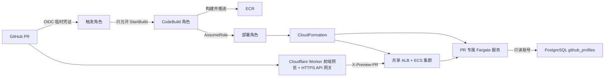
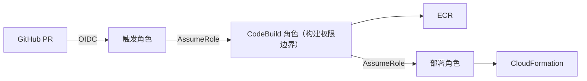

# PR 独立预览环境

这套方案的目标不是让每个 PR 复制一整套昂贵的基础设施，而是共享入口、隔离运行单元：

- 常驻资源：一个 ALB、一个 ECS 集群。
- 每个 PR：一个 Fargate 服务、任务定义、目标组、ALB 请求头规则、安全组和日志组。
- PR 打开或更新：构建镜像并创建/更新 `github-profile-pr-<编号>`。
- PR 关闭或合并：删除对应 CloudFormation 栈。
- Cloudflare：Worker Static Assets 承载前端；每个 PR 上传一个不切换生产流量的 Worker Version，使用
  `pr-<编号>-github-profile-sam-chi111.<子域>.workers.dev` 预览。



## Cloudflare Worker 前端预览

Cloudflare 不需要自定义域名。生产前端使用 `github-profile-sam-chi111.<子域>.workers.dev`，PR 前端使用
Worker Preview URL。仓库需要以下配置：

| 类型 | 名称 | 用途 |
| --- | --- | --- |
| Secret | `CLOUDFLARE_API_TOKEN` | 仅允许上传 Worker 版本 |
| Secret | `CLOUDFLARE_ACCOUNT_ID` | 指定部署账户 |
| Variable | `CLOUDFLARE_WORKER_NAME` | `github-profile-sam-chi111` |

前端构建和 Cloudflare 上传被拆成两个 GitHub Actions Job。PR 代码所在的 Job 不接收 Token，只上传静态构建
产物；第二个 Job 从可信 `main` 分支读取 [Wrangler 配置](../apps/web/wrangler.jsonc)，下载静态产物后才注入
Token。这样 PR 构建脚本无法读取 Cloudflare 凭证。Fork PR 不运行 Cloudflare 部署。

PR 构建会把 `VITE_SERVER_URL` 设置成自身 Worker Preview URL。Worker 只代理
`/api/go/health` 和 `/api/go/introductions/<username>`，把请求改写到共享 ALB，并添加
`X-Preview-PR: <编号>`。ALB 按该头路由到 PR 专属 ECS Service。响应会增加 `preview.prNumber`、
`preview.runtime=go` 和 `preview.service=github-profile-go`，因此可以在页面和 Network 中直接验证。

## 三个 IAM 角色为什么分开

| 角色 | 能做什么 | 不能做什么 |
| --- | --- | --- |
| `github-profile-pr-trigger-role` | GitHub OIDC 登录；启动并查询指定 CodeBuild 项目 | 不能推镜像、不能创建 ECS |
| `github-profile-codebuild-role` | 写构建日志、推送指定 ECR、承担部署角色 | 不能直接管理整个 AWS 账户 |
| `github-profile-pr-deploy-role` | 创建和删除预览所需的 CloudFormation/ECS/ALB/安全组/日志资源 | 不能创建 IAM 角色；只能 Pass 现有 ECS 执行角色 |

GitHub 和 CodeBuild 都不保存长期 Access Key。所有权限都是短期凭证。

## CodeBuild 配额为 0 时的执行器切换

新 AWS 账户可能暂时无法启动任何 CodeBuild 构建。此时设置 GitHub 仓库变量
`PR_EXECUTOR=github-actions`，工作流会保留相同的三角色权限链，只把执行计算从 CodeBuild 容器切换到
GitHub 托管 Runner：



`github-profile-codebuild-role` 在这里仍代表“构建权限边界”，只是暂时不由 CodeBuild 服务承担计算。
AWS 放开配额后，将 `PR_EXECUTOR` 改成 `codebuild` 即可切回原路径。

手动配置三项 IAM：

1. 将 `github-profile-pr-trigger-role` 的信任关系更新为
   [触发角色回退信任策略](../infra/iam/pr-trigger-fallback-trust-policy.example.json)，只允许本仓库 PR 和 `main`。
2. 将 [触发角色回退权限](../infra/iam/pr-trigger-fallback-policy.example.json) 添加到
   `github-profile-pr-trigger-role`。
3. 将 `github-profile-codebuild-role` 的信任关系更新为
   [构建角色回退信任策略](../infra/iam/codebuild-fallback-trust-policy.example.json)。它同时信任 CodeBuild 服务和
   唯一的触发角色，不直接信任任意 GitHub 工作流。

Cloudflare Worker 使用 HTTPS，ALB 仍可保持 HTTP 原点。直接验证 ALB 时使用：

```bash
curl -H 'X-Preview-PR: <编号>' http://<共享ALB域名>/readyz
```

首次使用 GitHub Actions 回退路线：

1. Actions → `PR preview shared base` → 保持 Branch 为 `main`，选择 `deploy`，创建共享 ALB 和 ECS 集群。
2. 创建同仓库分支的 PR，`PR preview environment` 自动构建镜像并创建 PR Stack。
3. 工作流先验证 ALB → PR ECS → PostgreSQL，再验证最终 Cloudflare HTTPS 预览地址。
4. 关闭 PR，等待 PR Stack 自动删除。
5. 学习期间保留共享 Base Stack；只有确定不再使用预览环境时才运行 `destroy` 停止 ALB 费用。

删除共享 Base Stack 前必须先关闭所有预览 PR，否则 CloudFormation 导出仍被 PR Stack 引用，删除会失败。

GitHub 仓库变量：

| 名称 | 值 |
| --- | --- |
| `PR_PREVIEW_ALB_URL` | `http://<共享 ALB DNS>` |
| `PR_DATABASE_SECRET_ARN` | 预览专用只读 PostgreSQL 连接串的 Secrets Manager ARN |
| `AURORA_SECURITY_GROUP_ID` | `sg-0b4619fa07595e65f`，保存前仍需在控制台核对 |
| `PREVIEW_TEST_USERNAME` | `Chi111`，必须是 `github_profiles` 中已存在的 login |

## CodeBuild 手动配置

在创建项目之前，先把 [部署权限示例](../infra/iam/pr-deploy-policy.example.json) 作为内联策略添加到
`github-profile-pr-deploy-role`。

创建 CodeBuild 项目时填写：

| 项目 | 值 |
| --- | --- |
| 项目名 | `github-profile-pr-environment` |
| Source | `No source` |
| Buildspec | 选择内联，并复制 [buildspec.pr.yml](../buildspec.pr.yml) 全部内容 |
| Environment image | 最新的 AWS CodeBuild Ubuntu Standard 托管镜像 |
| Compute | Small |
| Privileged | 开启，Docker 构建需要 |
| Service role | 使用现有 `github-profile-codebuild-role` |
| Timeout | 60 分钟 |
| CloudWatch log group | `/aws/codebuild/github-profile-pr-environment` |
| Artifacts | 无 |
| Webhook | 不开启；由 GitHub Actions 显式启动 |

环境变量：

| 名称 | 值 |
| --- | --- |
| `REPOSITORY_URL` | `https://github.com/Chi111/aws-test.git` |
| `CONTROL_PLANE_REF` | `main` |
| `PR_ACTION` | `deploy-base`（GitHub Actions 会覆盖成 `deploy` 或 `destroy`） |
| `DEPLOY_ROLE_ARN` | `arn:aws:iam::311816466050:role/github-profile-pr-deploy-role` |
| `ECR_REPOSITORY_URI` | `311816466050.dkr.ecr.us-east-2.amazonaws.com/github-profile-go` |
| `AWS_REGION` | `us-east-2` |
| `VPC_ID` | `vpc-0b653a19dd83dfa79` |
| `PUBLIC_SUBNET_IDS` | `subnet-0f1075ff3eaba752e,subnet-0afbf279c7e89bd2d,subnet-0af83aebdf25ab627` |
| `ECS_TASK_EXECUTION_ROLE_ARN` | `arn:aws:iam::311816466050:role/service-role/ecsTaskExecutionRole` |
| `DATABASE_SECRET_ARN` | 预览专用只读 PostgreSQL 连接串的 Secrets Manager ARN |
| `AURORA_SECURITY_GROUP_ID` | Aurora 数据库安全组 ID |
| `PREVIEW_TEST_USERNAME` | 数据库中已存在、用于端到端验收的 GitHub login |

不要把密码、数据库连接串或 Cloudflare API Token 放进普通环境变量。`DATABASE_SECRET_ARN` 只是 ARN，不是密码；
真正的连接串由 ECS Agent 从 Secrets Manager 注入。这个连接串必须属于预览专用只读账号，只能查询公开的
`github_profiles` 表，绝不能复用生产管理员账号。

## 首次运行顺序

1. 把本次代码合并到 `main`，因为 CodeBuild 只从可信主分支读取部署代码。
2. 手动启动一次 CodeBuild，保留 `PR_ACTION=deploy-base`，创建共享 ALB 和 ECS 集群。
3. 从 CloudFormation 输出复制 `LoadBalancerDNSName`。
4. 把 ALB URL 写入 GitHub 变量 `PR_PREVIEW_ALB_URL`，格式为 `http://<ALB DNS>`。
5. 在 Secrets Manager 创建预览只读数据库连接串，并把 ARN 写入 `PR_DATABASE_SECRET_ARN`。
6. 给 `ecsTaskExecutionRole` 添加 [预览 Secret 读取权限](../infra/iam/ecs-preview-secret-policy.example.json)。
7. 创建测试 PR；Actions 成功后访问 Cloudflare 的 `pr-<编号>-...workers.dev`。
8. 关闭 PR，确认 `github-profile-pr-<编号>` CloudFormation 栈被删除。

第一次创建预览数据库密钥时，先以键值 JSON 保存：

```json
{
  "username": "github_profile_preview",
  "password": "至少 32 位随机密码"
}
```

部署更新后的 SAM Stack 后，在 `github-profile-sam-dev-setup` Lambda 创建测试事件：

```json
{
  "action": "provision-preview-database-user",
  "secretArn": "复制 github-profile/pr-database-url 的完整 ARN"
}
```

Setup Lambda 会在 VPC 内创建或更新 PostgreSQL 账号，只授予数据库连接、`public` schema 使用权和
`public.github_profiles` 的 `SELECT`，然后把同一 Secret 更新成 ECS 可直接注入的 PostgreSQL URL。测试事件和日志
都不包含数据库密码。

## 成本与后续增强

- 共享 ALB 持续计费；每个打开的 PR 额外产生一个 0.25 vCPU / 512 MiB Fargate 任务。
- 为 ECR 增加生命周期规则，自动删除 7 天以上的 `pr-` 镜像。
- 当前 Fargate 使用公有子网和公网 IP，以避免 NAT Gateway 的固定费用；安全组只允许 ALB 访问 8080。
- 正式环境应改为私有子网，并使用 NAT 或 VPC Endpoint。
- 当前 ALB 原点是 HTTP。学习链路跑通后再增加 ACM 证书和 HTTPS Listener。
