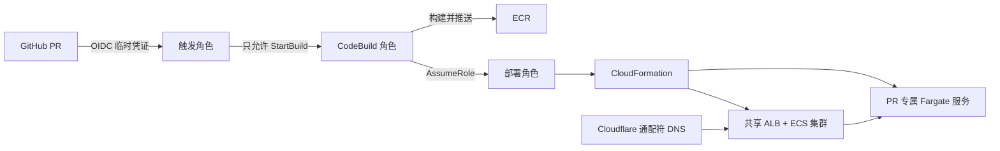

# PR 独立预览环境

这套方案的目标不是让每个 PR 复制一整套昂贵的基础设施，而是共享入口、隔离运行单元：

- 常驻资源：一个 ALB、一个 ECS 集群。
- 每个 PR：一个 Fargate 服务、任务定义、目标组、ALB 主机名规则、安全组和日志组。
- PR 打开或更新：构建镜像并创建/更新 `github-profile-pr-<编号>`。
- PR 关闭或合并：删除对应 CloudFormation 栈。
- Cloudflare：只配置一次通配符 DNS，`pr-<编号>.preview.<域名>` 自动进入共享 ALB。

## 三个 IAM 角色为什么分开

| 角色 | 能做什么 | 不能做什么 |
| --- | --- | --- |
| `github-profile-pr-trigger-role` | GitHub OIDC 登录；启动并查询指定 CodeBuild 项目 | 不能推镜像、不能创建 ECS |
| `github-profile-codebuild-role` | 写构建日志、推送指定 ECR、承担部署角色 | 不能直接管理整个 AWS 账户 |
| `github-profile-pr-deploy-role` | 创建和删除预览所需的 CloudFormation/ECS/ALB/安全组/日志资源 | 不能创建 IAM 角色；只能 Pass 现有 ECS 执行角色 |

GitHub 和 CodeBuild 都不保存长期 Access Key。所有权限都是短期凭证。

## CodeBuild 手动配置

在创建项目之前，先把 [部署权限示例](../infra/iam/pr-deploy-policy.example.json) 作为内联策略添加到
`github-profile-pr-deploy-role`。

创建 CodeBuild 项目时填写：

| 项目 | 值 |
| --- | --- |
| 项目名 | `github-profile-pr-environment` |
| Source | `No source` |
| Buildspec | 选择内联，并复制 [buildspec.pr.yml](../buildspec.pr.yml) 全部内容 |
| Environment image | 最新的 AWS CodeBuild Ubuntu Standard 托管镜像 |
| Compute | Small |
| Privileged | 开启，Docker 构建需要 |
| Service role | 使用现有 `github-profile-codebuild-role` |
| Timeout | 60 分钟 |
| CloudWatch log group | `/aws/codebuild/github-profile-pr-environment` |
| Artifacts | 无 |
| Webhook | 不开启；由 GitHub Actions 显式启动 |

环境变量：

| 名称 | 值 |
| --- | --- |
| `REPOSITORY_URL` | `https://github.com/Chi111/aws-test.git` |
| `CONTROL_PLANE_REF` | `main` |
| `PR_ACTION` | `deploy-base`（GitHub Actions 会覆盖成 `deploy` 或 `destroy`） |
| `DEPLOY_ROLE_ARN` | `arn:aws:iam::311816466050:role/github-profile-pr-deploy-role` |
| `ECR_REPOSITORY_URI` | `311816466050.dkr.ecr.us-east-2.amazonaws.com/github-profile-go` |
| `AWS_REGION` | `us-east-2` |
| `VPC_ID` | `vpc-0b653a19dd83dfa79` |
| `PUBLIC_SUBNET_IDS` | `subnet-0f1075ff3eaba752e,subnet-0afbf279c7e89bd2d,subnet-0af83aebdf25ab627` |
| `ECS_TASK_EXECUTION_ROLE_ARN` | `arn:aws:iam::311816466050:role/service-role/ecsTaskExecutionRole` |
| `PREVIEW_DOMAIN` | 例如 `preview.example.com`，后续换成你的 Cloudflare 域名 |

不要把密码、数据库连接串或 Cloudflare API Token 放进普通环境变量。本阶段的 PR 服务使用不可连接的占位数据库地址，
`/healthz` 可验证容器和 ALB，依赖数据库的接口不会伪装成可用。

## 首次运行顺序

1. 把本次代码合并到 `main`，因为 CodeBuild 只从可信主分支读取部署代码。
2. 手动启动一次 CodeBuild，保留 `PR_ACTION=deploy-base`，创建共享 ALB 和 ECS 集群。
3. 从 CloudFormation 输出复制 `LoadBalancerDNSName`。
4. 在 Cloudflare 建立 `*.preview` 的 CNAME，目标是该 ALB DNS。
5. 在 GitHub 仓库变量中配置 `PREVIEW_DOMAIN` 和 `AWS_REGION=us-east-2`。
6. 创建测试 PR；Actions 成功后访问 `http://pr-<编号>.<PREVIEW_DOMAIN>/healthz`。
7. 关闭 PR，确认 `github-profile-pr-<编号>` CloudFormation 栈被删除。

## 成本与后续增强

- 共享 ALB 持续计费；每个打开的 PR 额外产生一个 0.25 vCPU / 512 MiB Fargate 任务。
- 为 ECR 增加生命周期规则，自动删除 7 天以上的 `pr-` 镜像。
- 当前 Fargate 使用公有子网和公网 IP，以避免 NAT Gateway 的固定费用；安全组只允许 ALB 访问 8080。
- 正式环境应改为私有子网，并使用 NAT 或 VPC Endpoint。
- 当前 ALB 原点是 HTTP。学习链路跑通后再增加 ACM 证书和 HTTPS Listener。
